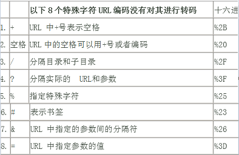

# 接口调用及异常说明 

----------  

<h2 id="cid_0">接口调用</h2>  

统一的接入url为：https://ip:port/thirdpartaccess ，请求类型为POST。  

系统级通用请求参数： 

<table>
<tr><td>参数</td><td>值</td><td>描述</td></tr>
<tr><td>appKey</td><td></td><td>应用key，在Mplus管理端创建</td></tr>
<tr><td>method</td><td>具体方法确认</td><td>接口定义</td></tr>
<tr><td>v</td><td>具体方法确认</td><td>版本</td></tr>
<tr><td>format</td><td>json</td><td>响应体格式json</td></tr>
<tr><td>sign</td><td>签名值</td><td>请求体签名</td></tr>
<tr><td>local</td><td>本地化类型</td><td>默认为zh_CN</td></tr>
</table>  

下面是添加机构接口的请求样例：  

sign签名方法为：首先按参数key字母a-z顺序将所有<font color="red">参数名</font>和<font color="green">参数值</font>成一个字符串：   

<font color="red">appKey</font><font color="green">00001</font><font color="red">assignedLicenseNum</font><font color="green">1</font><font color="red">format</font><font color="green">json</font><font color="red">locale</font><font color="green">zh_CN</font><font color="red">format</font>memo</font><font color="green">webapi1</font><font color="red">method</font><font color="green">mobileark.addorg</font><font color="red">orgCode</font><font color="green">webapi1</font><font color="red">orgName</font><font color="green">webapi11</font><font color="red">v</font><font color="green">1.0</font>  

假设，appKey为00001的secret(应用密钥)是“asd”，则将“asd ”分别添加到以上请求参数串的头部和尾：  

<font color="red">asd</font>appKey00001assignedLicenseNum1formatjsonlocalezh_CNmemowebapi1methodmobileark.addorgorgCodewebapi1orgNamewebapi11v1.0<font color="red">asd</font>  

对以上字符串进行SHA1签名运算，将签名值转换为十六进制的编码串，得到：  

```
762C1F1B50B40F92F89B4A45C34E82CC4678FE2B
```  

这就是最终生成的sign参数值，最后，客户端即可发起请求调用接口服务方法，下面是http请求信息：

```
POST /thirdpartaccess HTTP/1.1
Accept: text/plain, application/json, */*
Content-Type: application/x-www-form-urlencoded
User-Agent: Java/1.6.0_45
Host: 192.168.160.98:6001
Connection: keep-alive
Content-Length: 180

assignedLicenseNum=1&memo=webapi1&locale=zh_CN&format=json&orgName=webapi11&sign=762C1F1B50B40F92F89B4A45C34E82CC4678FE2B&v=1.0&orgCode=webapi1&method=mobileark.addorg&appKey=00001HTTP/1.1 200 OK
Date: Mon, 26 May 2014 09:17:04 GMT
Transfer-Encoding: chunked
Content-Type: application/json
X-Powered-By: Servlet/3.0 JSP/2.2
```   

<h2 id="cid_1">接口参数（必看）</h2>  

* 系统层参数和业务层参数（标注为必须）需作为请求体发送，非必须参数可以不传，传递必须遵循参数的约束规则。	
* 所有必须参数不可以为空字符串，空字符串将在服务端被忽略。修改时空字符串视为有效请求字段，对应字段修改为空字符或者默认值。
* 对于特殊字符问题，应遵循URL转义规则在调用接口前处理。详细见下表：    

<div align="center"></div>  

<h2 id="cid_2">异常说明</h2>  

ROP框架定义了自己的错误格式和错误编码，其中业务级异常用户开发者扩展异常，开发者可以定义自己的业务异常和异常编码。ROP框架的错误都对应一个唯一的数字编码，目前共包括27个错误，通过下表进行说明：  

<div align="center">系统级错误编码</div>  

<table>
   <tr>
      <td>错误编码</td>
      <td>错误说明</td>
      <td>错误编码</td>
      <td>错误说明</td>
      <td>错误编码</td>
      <td>错误说明</td>
   </tr>
   <tr>
      <td>1</td>
      <td>服务不可用</td>
      <td>20</td>
      <td>缺少sessionId参数</td>
      <td>29</td>
      <td>非法的版本参数</td>
   </tr>
   <tr>
      <td>2</td>
      <td>开发者权限不足</td>
      <td>21</td>
      <td>无效的sessionId参数</td>
      <td>30</td>
      <td>不支持的版本号</td>
   </tr>
   <tr>
      <td>3</td>
      <td>用户权限不足</td>
      <td>22</td>
      <td>缺少appKey参数</td>
      <td>31</td>
      <td>无效报文格式类型</td>
   </tr>
   <tr>
      <td>4</td>
      <td>图片上传失败</td>
      <td>23</td>
      <td>无效的appKey参数</td>
      <td>32</td>
      <td>缺少必选参数</td>
   </tr>
   <tr>
      <td>5</td>
      <td>HTTP方法被禁止</td>
      <td>24</td>
      <td>缺少签名参数</td>
      <td>33</td>
      <td>非法的参数</td>
   </tr>
   <tr>
      <td>6</td>
      <td>编码错误</td>
      <td>25</td>
      <td>无效签名</td>
      <td>34</td>
      <td>用户调用服务的次数超限</td>
   </tr>
   <tr>
      <td>7</td>
      <td>请求被禁止</td>
      <td>26</td>
      <td>缺少方法名参数</td>
      <td>35</td>
      <td>会话调用服务的次数超限</td>
   </tr>
   <tr>
      <td>8</td>
      <td>服务已经作废</td>
      <td>27</td>
      <td>不存在的方法名</td>
      <td>36</td>
      <td>应用调用服务的次数超限</td>
   </tr>
   <tr>
      <td>9</td>
      <td>业务逻辑出错</td>
      <td>28</td>
      <td>缺少版本参数</td>
      <td>37</td>
      <td>应用调用服务的频率超限</td>
   </tr>
</table>  

以上27个系统级错误具体可以划分为以下几类：  

* 系统级参数错误：这类错误是由于系统级请求参数缺失或不合法引起的，20~31都是这一类型的错误；
* 业务级参数错误：业务级参数缺失或不合法而引起的错误，如32和33；
* 服务访问超限错误：客户端的服务调用超过配额，34~37都是这一类型的错误；
* 权限不足错误：如2和3错误都是开发者或应用用户的权限不足，造成服务无法访问错误；
* 其它错误：以上类型之外的错误。  

系统级错误响应JSON格式如下：  

```
{"code":"1027","message":"不存在的方法名","solution":"无效的方法，请检查服务方法名是否正确"}
```  

注：其中code是占4位的字符串，10为固定占位，27对应上表中错误码27，message对应的错误说明，solution为解决此错误的提示。  

业务级错误响应JSON格式如下：  

```
{"code":"1009", "message":"业务逻辑出错","solution":"请了解服务调用的前置条件，检查是否满足业务逻辑", "subErrors":[{"code":"isv.mobileark-addorg-service-error:-90002", "message":"机构编码已存在，请重新设置机构编码。"}]}
```   

注：其中所有的业务级错误code都为1009，subErrors为开发者自定义的业务异常。  

