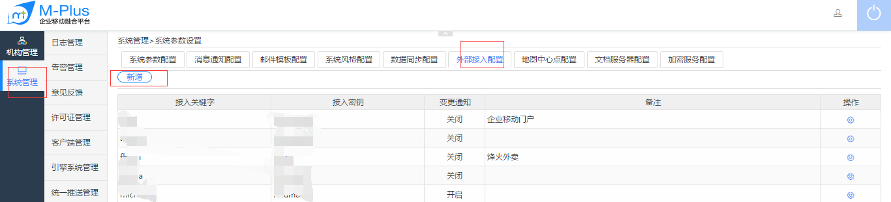
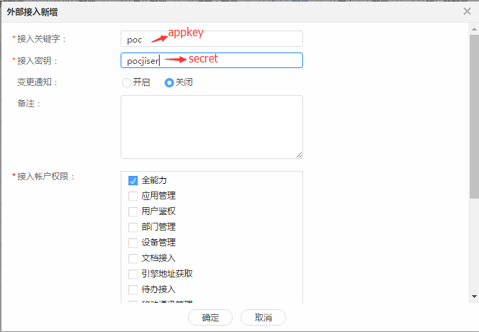

# 术语和缩略语 

----------  

<h2 id="cid_0">缩略语</h2>  

<table>
<tr>
<td>术语</td><td>英文解释</td><td>中文解释</td>
</tr>
<tr>
<td>Rop</td><td>Rapid Open Platform</td><td>Rest Web Service 开源框架</td>
</tr>
</table>  

<h2 id="cid_1">术语</h2>  

> 应用标识（appKey）——第三方接入系统许可证  

> 应用密钥（secret）——应用密钥，参与加密生成sign参数  

应用标识和应用密钥生成途径：  

用系统管理员帐号登录Mplus平台的web管理端，然后访问【系统管理】——【外部接入配置】页面，在此页面新增外部接入配置，见下图：  

  

  

在新增外部接入配置时，最下方的“接入账户权限”表示这个接入配置，第三方业务系统在使用时可以访问哪些接口，这些接口的功能请参考后续的接口列表章节。  
